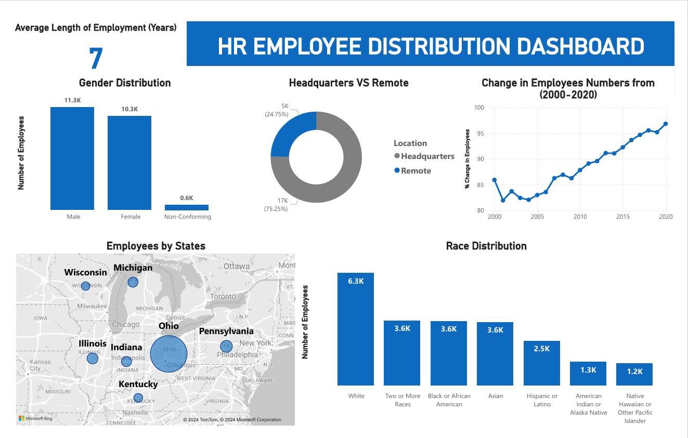

# HR-Dashboard-SQL Server-PowerBI

## Data Used

**Data** - HR Data with over 22000 rows from the year 2000 to 2020.

**Data Cleaning & Analysis** - Microsoft SQL Server

**Data Visualization** - PowerBI

## Questions

1. What is the gender breakdown of employees in the company?
2. What is the race/ethnicity breakdown of employees in the company?
3. What is the age distribution of employees in the company?
4. How many employees work at headquarters versus remote locations?
5. What is the average length of employment for employees who have been terminated?
6. How does the gender distribution vary across departments and job titles?
7. What is the distribution of job titles across the company?
8. Which department has the highest turnover rate?
9. What is the distribution of employees across locations by state?
10. How has the company's employee count changed over time based on hire and term dates?
11. What is the tenure distribution for each department?

## Summary of Findings
 - There are more male employees
 - White race is the most dominant while Native Hawaiian and American Indian are the least dominant.
 - The youngest employee is 22 years old and the oldest is 59 years old
 - 5 age groups were created (18-24, 25-34, 35-44, 45-54, 55-64). A large number of employees were between 35-44 followed by 25-34 and 45-54 while the smallest group  was 18-24.
 - A large number of employees work at the Headquarters versus Remotely.
 - The average length of employment for terminated employees is around 7 years.
 - The gender distribution across departments is fairly balanced but there are generally more male than female employees.
 - The Auditing department has the highest turnover rate followed by Legal. The least turn over rate are in the Marketing and Business Development.
 - A large number of employees come from the state of Ohio.
 - The net change in employees has increased over the years.

